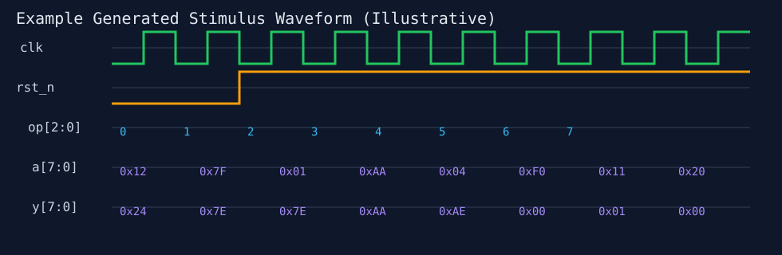
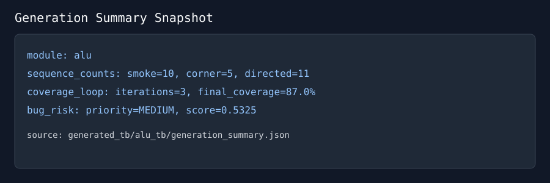

# AI-Assisted UVM Testbench Generator

[](#quick-start)
[](#generated-artifacts)
[](#project-highlights)

Generate a **UVM testbench scaffold automatically from RTL** and improve stimulus quality with an AI-guided loop.

- **Input:** RTL module (ALU / cache block / pipeline stage)
- **Output:** Auto-generated UVM environment + sequence planning + risk summary
- **AI layer:** Python modules for sequence generation, coverage-driven improvement, and bug-risk prioritization

---

## Project Highlights

✅ Auto sequence generation (heuristic by default, optional LLM mode)  
✅ Coverage-driven improvement loop from coverage-hole JSON  
✅ Bug prediction / prioritization report  
✅ End-to-end CLI flow and test coverage  
✅ Portfolio-ready structure for GitHub showcase

---

## Features

### 1) Auto Sequence Generation
- Parses RTL port signatures and builds randomized smoke vectors + corner vectors.
- Detects opcode-like control signals (`op`, `opcode`, `sel`, `cmd`) and creates directed sweeps.
- Optional OpenAI API mode can synthesize scenario vectors when `OPENAI_API_KEY` is set.

### 2) Coverage-Driven Improvement Loop
- Accepts coverage JSON containing uncovered bins/holes.
- Iteratively appends targeted vectors to close known holes.
- Produces iteration and projected coverage metrics in `generation_summary.json`.

### 3) Bug Prediction / Prioritization
- Computes structural risk features from module I/O.
- Produces `LOW` / `MEDIUM` / `HIGH` priority with rationale.
- Helps triage what to verify first in constrained schedules.

---

## Repository Layout

```text
.
├── ai/
│   ├── rtl_parser.py
│   ├── sequence_generator.py
│   ├── coverage_loop.py
│   ├── bug_predictor.py
│   ├── uvm_renderer.py
│   └── models.py
├── tools/
│   └── generate_uvm.py
├── examples/
│   ├── rtl/alu.sv
│   └── coverage/alu_cov.json
├── generated_tb/
│   └── alu_tb/
├── tests/
│   └── test_parser_and_build.py
└── README.md
```

---

## Quick Start

```bash
python3 -m venv .venv
source .venv/bin/activate
pip install -r requirements.txt

python tools/generate_uvm.py \
  --rtl examples/rtl/alu.sv \
  --out generated_tb/alu_tb \
  --module alu \
  --coverage-report examples/coverage/alu_cov.json
```

Run tests:

```bash
pytest -q
```

---

## Generated Artifacts

For module `alu`, the tool emits:

- `alu_if.sv` – interface + clocking blocks
- `alu_tb_pkg.sv` – seq_item, sequence, driver, monitor, scoreboard, agent, env, test
- `alu_tb_top.sv` – DUT + interface hookup + `run_test`
- `run_manifest.txt` – compile/run checklist
- `generation_summary.json` – sequence stats + coverage loop + bug risk

---


## Sample Output Visuals

### Generated Waveform (Illustrative)


### Generation Summary Snapshot


---
## Optional LLM Mode

Enable with:

```bash
export OPENAI_API_KEY="<your_key>"
export OPENAI_MODEL="gpt-4o-mini"
pip install openai
```

If key or SDK is unavailable, the generator automatically uses offline heuristics.

---

## Why This Project is Resume-Worthy

This project demonstrates practical verification + AI integration skills:

- RTL-aware code generation for UVM-based environments
- Python automation and clean CLI tooling
- Coverage closure strategy and feedback-loop design
- Risk-based verification prioritization
- Test-driven implementation and reproducible output artifacts

A ready-to-copy resume section is included in [`RESUME_ENTRY.md`](RESUME_ENTRY.md).

---

## Roadmap

- Add transaction-level reference model synthesis from RTL expressions
- Integrate simulator adapters (Questa/VCS/Xcelium) for one-command run
- Add UCIS/coverage database parsing for real coverage closure loop
- Add prompt templates for protocol-aware stimulus strategies

---

## License

MIT
